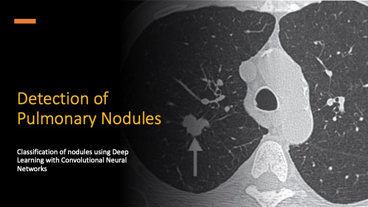
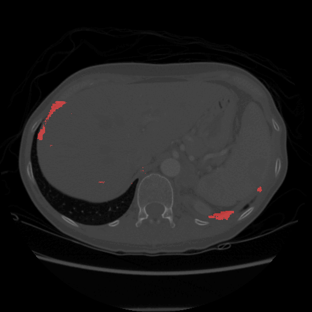
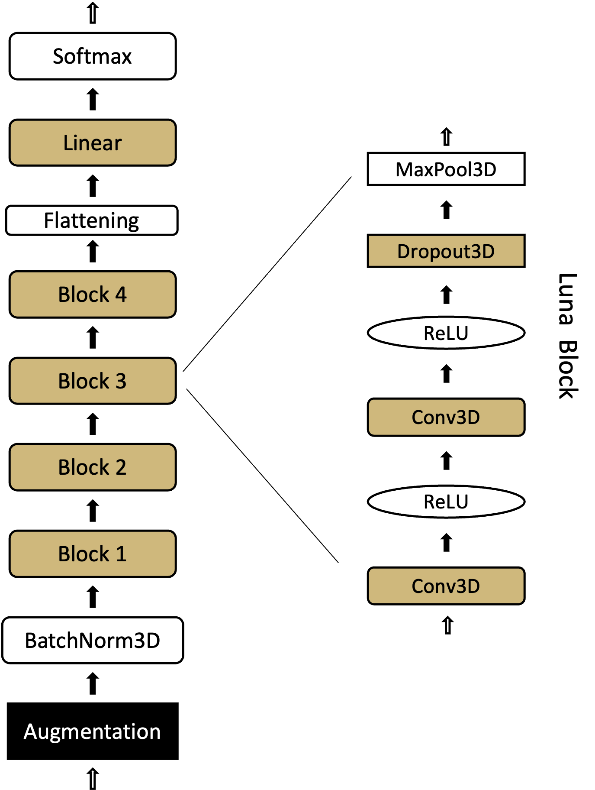

# Automated Lung Cancer Detection Through Deep Learning

## Motivation
Lung cancer remains the predominant cause of cancer-related mortality on a global scale. Despite technological advances, early detection of lung cancer remains a challenge, often requiring highly specialized manual review of Computed Tomography (CT) scans. This project aims to develop an automated method for identifying potential malignancies in lung CT scans. Working on this problem offers the opportunity to delve deep into state-of-the-art deep learning frameworks, particularly PyTorch.

## Project Scope
This project proposes an end-to-end deep learning solution (CNNs) for identifying and classifying lung nodules as benign or malignant, based on the [LUNA16 Grand Challenge](https://luna16.grand-challenge.org) dataset. It will have 3 stages:
1. Segmentation: Deploy a model to identify potential nodule locations in CT scans.
2. Nodule Candidate Classification: Implement a model to classify regions of interest as nodule or non-nodule.
3. Malignancy Classification: Implement a model to classify identified nodules as benign or malignant.

The project started out as solely a classification task (stage 2). The paper detailing the project methodologies, results, and discussions can be found here: [CSCI_5502_Project.pdf](CSCI_5502_Project.pdf).

[[Watch the presentation]](https://youtu.be/ovUrZZ6Hyj8)

*Model scanning CT slices and predicting nodules. Positive predictions in Green. False positives in Red.*

## Final Results
The rows are the truth and the columns are how the model handled it.

|              | Complete Miss | Filtered Out | Pred. Benign | Pred. Malignant |
|--------------|---------------|--------------|--------------|----------------|
| Non-Nodules  |               | 227968       | 1392         | 346            |
| Benign       | 16            | 2            | 70           | 14             |
| Malignant    | 5             | 8            | 9            | 30             |

We detect about 80% of nodules and correctly identify 58% of the malignant ones. 

## Part 1: Segmentation of CT Scans.

### Segmentation Results

| Metric           | Value      |
|------------------|------------|
| Precision        | 0.0225     |
| Recall           | 0.8319     |
| F1 Score         | 0.0438     |
| True Positive    | 83.2%      |
| False Negative   | 16.8%      |
| False Positive   | 3618.1%    |

The elevated false positive rate observed in the validation phase is anticipated due to the significant disparity in the dimensions of the datasets used for training and validation. Specifically, the validation dataset encompasses an area of $2^{18}$ pixels, which is notably larger than the $2^{12}$ pixels area utilized for the training dataset. This results in a validation area that is 64 times greater in size compared to the training area. Given this context, our focus was primarily on optimizing the recall metric, with the understanding that any precision-related concerns will be addressed by the downstream classification model. 

                 |    Complete Miss |     Filtered Out |     Pred. Nodule
     Non-Nodules |                  |           227968 |             1738
          Benign |               16 |                2 |               84
       Malignant |                5 |                8 |               39

The segmentation model detected 81% of the nodules.

### Examples of segmentation output. 

Positive predictions in Green. False positives in Red.

## Part 2: Classification of Candidate Nodules.
[CSCI_5502_Project.pdf](CSCI_5502_Project.pdf).

### Classification Model Architecture

### Results

#### Results Table

| Metric    | Value    |
|-----------|----------|
| FROC      | 99.27%   |
| F2        | 12.46%   |
| Recall    | 95.51%   |
| FPR       | 6.91%    |
| Precision | 2.78%    |

#### Confusion Matrix

|                  | Predicted Positive | Predicted Negative |
|------------------|--------------------|--------------------|
| **Actual Positive** | 149                | 7                  |
| **Actual Negative** | 5207               | 70135              |

#### FROC Curve

*The FROC curve illustrates the trade-off between sensitivity and the average number of false positives per scan, showcasing the performance of our model.*

## Part 3: Classification of Nodules.

To distinguish between malignant and non-malignant nodules, we employ a process known as fine-tuning. Fine-tuning involves making slight adjustments to a pre-trained model to tailor it more closely to the specific nuances of our current task. In this process, we specifically focus on retraining the model's final linear layer (also known as the head) and the last convolutional block. This approach allows us to adjust the model to new data while retaining the valuable insights learned from its previous training, ensuring that the bulk of the pre-trained model's weights remain unaltered.

### Fine-tuning Results
| Metric       | Value    |
|--------------|----------|
| Precision    | 0.7368   |
| Recall       | 0.8077   |
| F1 Score     | 0.7706   |
| FPR          | 0.1471   |
| AUC          | 0.9070   |